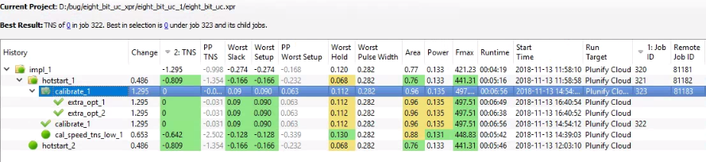

# plunifycloud_tutorial
## Introduction
This is a simple tutorial for user to use Plunify Cloud service through InTime software. This tutorial covers the  Hot Start recipe, InTIme Default recipe, and Extra Opt Exploration recipe. The recipe flow and their configurations are shown as below.

**Recipe 1 : Hotstart**
  - runs per round  : 2
  - rounds          : 1
  - concurrent runs : 2
  
**Recipe 2 : InTime Default**
  - runs per round  : 2
  - rounds          : 1
  - concurrent runs : 2

**Recipe 3 : Extra Opt Exploration**
  - runs per round  : 2
  - rounds          : 1
  - concurrent runs : 2

## Requirements
1. Intime software
2. Vivado 2017.2
3. Plunify Cloud account with atleast 100 credits. [Register](https://cloud.plunify.com/register) new account to get free 100 credits

## Steps

1. Clone the sample project.

`git clone https://plunifyot/plunifycloud_tutorial`

2. Unzip the project/eight_bit_uc.xpr.zip file.

3. Start Intime and open the sample eight_bit_uc project.

4. Select the targeted toolchain. For this tutorial, we will use version 2017.2.

5. Change the 'Run Target' option to 'Plunify Cloud'.

6. Change 'Recipe' option to 'Hot Start'.

7. Configure the desired value for 'runs per round', 'rounds', 'concurrent runs' options as outlined in Introduction section.

8. Click 'Start Recipe' to submit the job to Plunify Cloud.

9. Enter your Plunify Cloud credential. Note you only need to do this once.

10. Select the class of machine to use for cloud compilation. Use Class 1 machine for this tutorial.

11. After the class of machine is chosen, Intime will create a job ID for this submission and upload the project into Plunify Cloud for compilation. A notification will be shown if the job submission is successful. Record the remote job ID ( 81181 for this example ). You may use this job ID to track the job status in [Plunify Cloud website](https://cloud.plunify.com/).

12. (Optional) In the Plunify Cloud website, check the job status under 'History'>'Usage History'

13. Upon completion, a notification email will be sent into your email inbox.

14. Back to Intime software, right click 'impl 1' parent revision and select **Job Action>Download Remote Results>Download Remote Results Without Project File** to download the results into Intime.

15. Change 'Recipe' option to 'Intime Default'.

16. Selects the revision which has the best TNS result as parent revision. In this example, the revision which has the best TNS result is hotstart_1.

17. Repeat Step 7 to Step 14 for Intime Default recipe run. 

18. Change 'Recipe' option to 'Extra Opt Exploration'.

19. Selects the revision which has the best TNS result as parent revision. In this example, the revision which has the best TNS result is calibrate_1. **Note** the calibrate_1 revision is already met timing but we are going to ignore it in order to complete this tutorial. For next run, the 'Stop When Goal Met' option is set to 'False' in order to continue the run. 

20. Repeat Step 7 to Step 14 for Extra Opt Exploration recipe run. 

21. Upon completion, the intime results should look like below.

